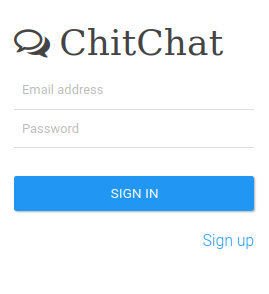

# ChitChat

   

ChitChat is a simple chat forum. Users can start threads and comment on other threads.  
Internally multiplexer redirects request to handlers. Handlers 
connect to database and implement the needed logic to respond to the request.  
ChitChat uses Markdown to render text.

### Requirements 
- Go 1.19 
- SQLite.
### Installation
Clone the repository and run `./install.sh`. 

### Acknowledgement
This project started as an exercise when I was reading `Go web programming` by manning publication. 
All files from public directory are copied from book repository. I implemented the backend myself to make sure I understand everything in the book. 
